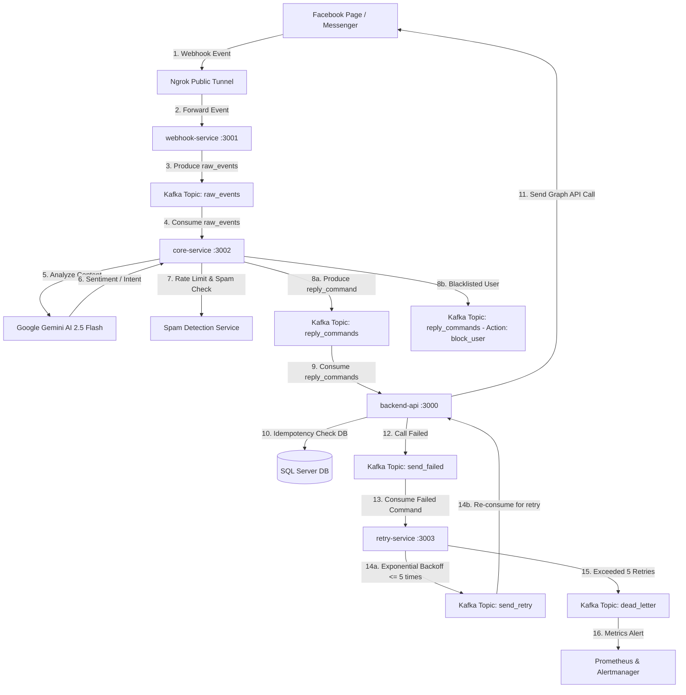

# Distributed Facebook Webhook & Automation Management System
> **Hệ thống Quản lý và Tự động hóa Phản hồi Facebook Phân tán**
> Một dự án thực tiễn thiết kế hệ thống Microservices hướng sự kiện (Event-Driven Architecture) chịu tải cao, tích hợp AI phân tích cảm xúc và cơ chế tự phục hồi lỗi tiêu chuẩn Production.

---

## 📖 MỤC LỤC
1. [Giới thiệu dự án](#-giới-thiệu-dự-án)
2. [Kiến trúc hệ thống (Architecture)](#-kiến-trúc-hệ-thống-architecture)
3. [Chi tiết các Microservices](#-chi-tiết-các-microservices)
4. [Các giải pháp kỹ thuật chuyên sâu](#-các-giải-pháp-kỹ-thuật-chuyên-sâu)
   - [Trí tuệ nhân tạo (AI Engine)](#1-trí-tuệ-nhân-tạo-ai-engine)
   - [Phát hiện Spam thông minh](#2-phát-hiện-spam-thông-minh)
   - [Độ bền bỉ & Chịu lỗi (Resilience & Fault Tolerance)](#3-độ-bền-bỉ--chịu-lỗi-resilience--fault-tolerance)
   - [Đảm bảo Idempotency](#4-đảm-bảo-idempotency-chống-trùng-tin)
5. [Cấu hình hệ thống (Configuration)](#%EF%B8%8F-cấu-hình-hệ-thống-configuration)
6. [Hướng dẫn vận hành (Deployment & Setup)](#-hướng-dẫn-vận-hành-deployment--setup)
7. [Kịch bản kiểm thử & Mô phỏng lỗi (Testing Matrix)](#-kịch-bản-kiểm-thử--mô-phỏng-lỗi-testing-matrix)

---

## 🚀 GIỚI THIỆU DỰ ÁN

Hệ thống được phát triển với mục đích giải quyết bài toán tự động hóa tương tác khách hàng thời gian thực trên mạng xã hội Facebook. Điểm cốt lõi của dự án là không sử dụng các kịch bản cứng (hard-coded rules), mà kết hợp **mạng lưới Microservices**, hàng đợi tin nhắn **Apache Kafka** để đảm bảo khả năng mở rộng (Scalability) và mô hình **Generative AI** để thấu hiểu tâm lý khách hàng.

Dự án được phân rã thành **4 dịch vụ độc lập** viết bằng .NET 8.0, phối hợp với hạ tầng Docker ảo hóa dữ liệu, mang lại hiệu năng ổn định cùng khả năng kháng lỗi cực kỳ mạnh mẽ.

---

## 📐 KIẾN TRÚC HỆ THỐNG (ARCHITECTURE)

Dưới đây là sơ đồ luồng đi của dữ liệu từ mạng xã hội Facebook qua hệ thống nội bộ, xử lý bất đồng bộ thông qua các Kafka Topic và đưa ra quyết định thông minh:



---

## 📦 CHI TIẾT CÁC MICROSERVICES

### 1. `webhook-service` (Cổng tiếp nhận dữ liệu - Port `3001`)
*   **Nhiệm vụ**: Đóng vai trò là Endpoint công khai duy nhất tiếp nhận các tín hiệu Webhook từ Facebook Graph API.
*   **Tính năng chính**:
    *   Xác thực lớp bảo mật `VerifyToken` trong giai đoạn Handshake với Facebook.
    *   Parse nhanh dữ liệu thô (JSON Payload) từ Facebook, trích xuất thông tin comment cơ bản.
    *   Đẩy sự kiện thô vào Kafka topic `raw_events` dưới dạng phi tập trung trong **dưới 10ms** để giải phóng luồng HTTP kết nối của Facebook ngay lập tức.

### 2. `core-service` (Bộ não phân tích và Phán quyết - Port `3002`)
*   **Nhiệm vụ**: Xử lý logic nghiệp vụ chính của hệ thống.
*   **Tính năng chính**:
    *   Lắng nghe liên tục sự kiện từ topic `raw_events`.
    *   Chuyển tiếp nội dung comment sang dịch vụ AI để bóc tách ý nghĩa.
    *   Kiểm tra hành vi quấy rối (Spam) qua bộ nhớ đệm tần suất.
    *   Phát hành các lệnh thực thi (`reply_comment`, `hide_comment`, `block_user`) vào topic `reply_commands`.

### 3. `backend-api` (Bộ thực thi và Quản lý dữ liệu - Port `3000`)
*   **Nhiệm vụ**: Thực hiện trực tiếp các cuộc gọi tác vụ đến API Graph của Facebook và ghi nhận trạng thái vào Cơ sở dữ liệu.
*   **Tính năng chính**:
    *   Đăng ký lắng nghe topic `reply_commands`.
    *   Kiểm tra tính nhất quán (Idempotency Key) trên SQL Server trước khi gọi API bên thứ ba.
    *   Quản lý lịch sử tương tác và cấu hình hệ thống qua Database.

### 4. `retry-service` (Bảo hiểm chịu lỗi - Port `3003`)
*   **Nhiệm vụ**: Tự động phát hiện lỗi và quản lý tiến trình thử lại thông minh bất đồng bộ.
*   **Tính năng chính**:
    *   Lắng nghe các lệnh gửi lỗi từ topic `send_failed`.
    *   Tính toán thời gian trễ tăng dần và tái phát hành lệnh vào topic `send_retry`.
    *   Đảm nhận vai trò chuyển vùng cô lập lỗi sang Dead Letter Queue (`dead_letter`) khi số lần lỗi vượt ngưỡng.

---

## 🛠️ CÁC GIẢI PHÁP KỸ THUẬT CHUYÊN SÂU

### 1. Trí tuệ nhân tạo (AI Engine)
Hệ thống sử dụng Gemini 2.5 Flash thông qua API Generative Language để phân tích ngữ cảnh của bình luận:
*   **Phân loại Intent (Ý đồ)**: Phân biệt rõ đâu là câu hỏi giá cả (`price_inquiry`), hỏi thông tin sản phẩm (`info_inquiry`), lời chào hỏi xã giao (`greeting`), lời chê bai/khiếu nại (`complaint`) hay bình luận rác (`spam`).
*   **Phân tích Sentiment (Cảm xúc)**: Đánh giá cảm xúc người viết theo 3 mức độ: *Positive (Tích cực)*, *Neutral (Trung tính)*, và *Negative (Tiêu cực)*.
*   **Đưa ra quyết định**: 
    *   **Tích cực (`positive`) / Trung tính (`neutral`)**: Sinh câu trả lời cảm ơn ấm áp hoặc giải đáp chi tiết theo ngữ cảnh.
    *   **Tiêu cực (`negative`)**: Tự động sinh câu trả lời lịch sự xin lỗi khách hàng nhằm làm dịu tình hình như yêu cầu nghiệp vụ bài tập (Ví dụ: *"Rất xin lỗi vì trải nghiệm chưa tốt, bên mình sẽ kiểm tra ngay và liên hệ hỗ trợ bạn ạ!"*).
    *   **Cần con người kiểm duyệt (`NeedsHumanReview = True`)**: Chỉ kích hoạt đối với các tranh chấp thanh toán nghiêm trọng hoặc yêu cầu hoàn tiền phức tạp nằm ngoài phạm vi phản hồi thông thường.

### 2. Phát hiện Spam thông minh
Hệ thống tích hợp `SpamDetectionService` đóng vai trò chốt chặn bảo mật chống tấn công Spam bình luận:
*   Mỗi khi có bình luận từ người dùng, hệ thống sẽ kiểm tra tần suất bình luận của user đó trong vòng 24 giờ qua.
*   Nếu số lượng bình luận vượt ngưỡng **3 comment** liên tục trong thời gian ngắn hoặc nội dung lặp lại y hệt nhau, người dùng đó sẽ bị gắn cờ cảnh cáo và đưa vào danh sách đen (**Blacklist**).
*   Hệ thống sẽ ngay lập tức sinh lệnh ẩn bình luận (`hide_comment`) và gửi yêu cầu khóa quyền tương tác (`block_user`) trực tiếp lên Facebook Fanpage để bảo vệ tài nguyên trang.

### 3. Độ bền bỉ & Chịu lỗi (Resilience & Fault Tolerance)
Hệ thống được thiết kế theo tiêu chí **"Không bao giờ mất dữ liệu"** thông qua sự phối hợp của 3 mô hình bảo vệ:

#### A. Thử lại lũy thừa (Exponential Backoff)
Khi `backend-api` thực hiện cuộc gọi REST API sang Facebook nhưng gặp lỗi (ví dụ: mất kết nối, nghẽn mạng bên ngoài), tin nhắn sẽ được gửi sang `retry-service` thông qua topic `send_failed`.
Thời gian chờ của mỗi lần thử lại được tính toán tự động:
$$\text{Delay} = 1\text{s} \times 2^{\text{RetryCount} - 1}$$
*   **Lần 1**: Đợi 1 giây trước khi thử lại.
*   **Lần 2**: Đợi 2 giây trước khi thử lại.
*   **Lần 3**: Đợi 4 giây.
*   **Lần 4**: Đợi 8 giây.
*   **Lần 5**: Đợi 16 giây.
*   **Quá 5 lần thất bại**: Di chuyển sự kiện sang topic **`dead_letter` (Dead Letter Queue - DLQ)** để kỹ sư hệ thống kiểm tra thủ công.

#### B. Ngắt mạch hệ thống (Circuit Breaker)
Tích hợp thư viện **Polly** tại cổng giao tiếp API của `core-service` và `backend-api`:
*   Nếu API AI Gemini hoặc API Facebook bị lỗi liên tiếp **5 lần**, mạch điện sẽ tự động ngắt chuyển sang trạng thái **Open (Mở)**.
*   Mạch sẽ chặn ngay lập tức toàn bộ yêu cầu gọi API trong vòng **30 giây** tiếp theo (Fast-Fail) để giảm tải cho hệ thống và tránh lãng phí băng thông/tài nguyên.
*   Sau 30 giây, mạch chuyển sang trạng thái **Half-Open (Nửa mở)** để gửi thử nghiệm một vài gói tin nhằm đánh giá xem dịch vụ bên thứ ba đã phục hồi hay chưa trước khi đóng mạch bình thường.

### 4. Đảm bảo Idempotency (Chống trùng tin)
Trong môi trường mạng phân tán hướng sự kiện, việc một tin nhắn bị phân phối trùng lặp (At-least-once delivery) là điều hoàn toàn có thể xảy ra. Để tránh việc Fanpage trả lời một khách hàng 2 lần cùng một nội dung:
*   Mỗi Command gửi đi từ `core-service` đều được sinh kèm một mã định danh duy nhất `CommandId` (GUID).
*   Trước khi `backend-api` thực hiện gửi bình luận lên Facebook, nó sẽ thực hiện kiểm tra trong cơ sở dữ liệu SQL Server tại bảng `IdempotencyKeys`.
*   Nếu `CommandId` này chưa từng tồn tại, hệ thống sẽ thực hiện gửi API Facebook và lưu khóa này lại. Nếu đã tồn tại, hệ thống sẽ tự động bỏ qua, đảm bảo an toàn tuyệt đối.

---

## ⚙️ CẤU HÌNH HỆ THỐNG (CONFIGURATION)

Đảm bảo các file cấu hình tại các Microservices đã được đồng bộ chuẩn các giá trị kết nối sau:

### File: `backend-api/appsettings.json`
```json
{
  "ConnectionStrings": {
    "DefaultConnection": "Server=localhost,1435;Database=WebhookDb;User Id=sa;Password=Webhook@2026;TrustServerCertificate=True;"
  },
  "Facebook": {
    "AppSecret": "YOUR_FACEBOOK_APP_SECRET",
    "VerifyToken": "api_webhook_token_fakebook",
    "PageAccessToken": "YOUR_FACEBOOK_PAGE_ACCESS_TOKEN"
  },
  "Kafka": {
    "BootstrapServers": "localhost:9092"
  }
}
```

---

## 🚀 HƯỚNG DẪN VẬN HÀNH (DEPLOYMENT & SETUP)

Thực hiện theo đúng thứ tự 4 bước sau để khởi động dự án mượt mà nhất:

### Bước 1: Khởi động Hạ tầng Docker (Zookeeper, Kafka, Kafka UI)
Mở một cửa sổ PowerShell tại thư mục gốc dự án `Webhook_Service` và chạy:
```powershell
docker-compose up -d zookeeper kafka kafka-ui
```
*   **Kiểm tra**: Mở trình duyệt web của bạn và truy cập địa chỉ **[http://localhost:8085](http://localhost:8085)** để xem giao diện trực quan của cụm Kafka UI.

### Bước 2: Tạo đường hầm Ngrok
Mở một terminal mới và chạy lệnh tạo kết nối HTTPS công khai ánh xạ về cổng Webhook `3001`:
```powershell
ngrok http 3001
```
*   Copy đường dẫn HTTPS do Ngrok cung cấp (ví dụ: `https://xxxx-xxxx.ngrok-free.app`).
*   Vào ứng dụng của bạn trên **Facebook Developer Portal**, thiết lập URL phản hồi webhook trỏ đến địa chỉ: `https://xxxx-xxxx.ngrok-free.app/api/webhook`.
*   Nhập mã Verify Token: `api_webhook_token_fakebook`.

### Bước 3: Khởi chạy các Microservices .NET
Mở 4 cửa sổ terminal riêng biệt và chạy lần lượt các lệnh sau:

*   **Terminal 1 (Webhook-Service)**:
    ```powershell
    cd d:\API\Webhook_Service\webhook-service
    dotnet run
    ```
*   **Terminal 2 (Core-Service)**:
    ```powershell
    cd d:\API\Webhook_Service\core-service
    dotnet run
    ```
*   **Terminal 3 (Backend-API)**:
    ```powershell
    cd d:\API\Webhook_Service\backend-api
    dotnet run
    ```
*   **Terminal 4 (Retry-Service)**:
    ```powershell
    cd d:\API\Webhook_Service\retry-service
    dotnet run
    ```

---

## 🧪 KỊCH BẢN KIỂM THỬ & MÔ PHỎNG LỖI (TESTING MATRIX)

Dưới đây là cẩm nang hướng dẫn các bước thực tế giúp bạn tự tin thực hiện demo trực tiếp hoặc quay video báo cáo:

### 🟢 1. Test Kịch bản Tự động phản hồi thành công (Auto-reply)
*   **Hành động**: Dùng tài khoản cá nhân bình luận lên bài viết trên Trang Facebook của bạn:
    > *"Sản phẩm này còn hàng không shop ơi, tư vấn em giá với?"*
*   **Hiện tượng log hệ thống**:
    ```text
    info: core_service.Services.CoreEventConsumerService[0]
          [core-service] Nhận sự kiện bình luận từ Hoàng Đạt: "Sản phẩm này còn hàng..."
    info: core_service.Services.AiClassificationService[0]
          AI Phân tích: Intent = price_inquiry, Sentiment = positive, NeedsHumanReview = False
    info: core_service.Services.CoreEventConsumerService[0]
          Đã đẩy lệnh reply_comment thành công vào topic 'reply_commands'
    info: backend_api.Services.CommandConsumerService[0]
          [backend-api] Nhận lệnh từ topic 'reply_commands'. CommandId: a1b2c3d4...
    info: backend_api.Services.CommandConsumerService[0]
          Xác thực Idempotency thành công. Gửi phản hồi lên Facebook...
    info: backend_api.Services.FacebookApiService[0]
          ✅ Đã trả lời bình luận thành công trên Facebook Graph API!
    ```
*   **Kết quả trên Facebook**: Bình luận phản hồi chi tiết về giá cả sẽ xuất hiện dưới bình luận của bạn trong 1-2 giây.

### 🟡 2. Test Kịch bản Bỏ qua khiếu nại (Human Review Skip)
*   **Hành động**: Đăng bình luận mang tính tiêu cực/khiếu nại lên bài viết:
    > *"Dịch vụ giao hàng quá tệ, sản phẩm móp méo hộp nữa. Rất thất vọng!"*
*   **Hiện tượng log hệ thống**:
    ```text
    info: core_service.Services.CoreEventConsumerService[0]
          [core-service] Nhận sự kiện bình luận: "Dịch vụ giao hàng quá tệ..."
    info: core_service.Services.AiClassificationService[0]
          ⚠️ CẢNH BÁO AI: Intent = complaint, Sentiment = negative, NeedsHumanReview = True
    info: core_service.Services.CoreEventConsumerService[0]
          🛑 Cảnh báo khiếu nại! Bỏ qua chatbot tự động. Yêu cầu chuyển nhân viên kiểm duyệt.
    ```
*   **Kết quả**: Page giữ im lặng hoàn toàn, không tự trả lời câu trả lời máy móc vô hồn.

### 🛡️ 3. Test Kịch bản Phát hiện Spam (Blacklist & Block)
*   **Hành động**: Dùng tài khoản cá nhân viết bình luận **3 lần liên tiếp** thật nhanh (trong vòng 10 giây).
*   **Hiện tượng log hệ thống**:
    ```text
    warn: core_service.Services.SpamDetectionService[0]
          ⚠️ Phát hiện dấu hiệu spam từ User 26174065862265084 (3 comments trong 10s)
    fail: core_service.Services.SpamDetectionService[0]
          🚨 BLACKLIST: Đưa người dùng 26174065862265084 vào danh sách đen!
    info: core_service.Services.CoreEventConsumerService[0]
          Đã xuất lệnh ẩn bình luận 'hide_comment' và khóa tài khoản 'block_user' sang Kafka.
    ```
*   **Kết quả**: Các bình luận tiếp theo của user đó sẽ bị ẩn đi tự động đối với người dùng khác.

### ☠️ 4. Test Kịch bản Chịu lỗi Retry & Dead Letter Queue (DLQ)
*   **Hành động**: 
    1. Mở file `backend-api/appsettings.json` và thay đổi tạm thời 1 ký tự cuối của `PageAccessToken` thành giá trị sai.
    2. Đăng một bình luận tích cực lên trang: *"Tư vấn em với!"*
*   **Hiện tượng log hệ thống**:
    ```text
    fail: backend_api.Services.FacebookApiService[0]
          Gọi Facebook API thất bại. Status: 400 Bad Request (Invalid Token).
    info: backend_api.Services.CommandConsumerService[0]
          Lỗi tạm thời! Đẩy sự kiện vào topic 'send_failed' để kích hoạt Retry.
    info: retry_service.Services.RetryConsumerService[0]
          [retry-service] Nhận được tin nhắn lỗi. Số lần đã thử lại: 0. Bắt đầu thử lại lần 1 sau 1s...
    info: retry_service.Services.RetryConsumerService[0]
          [retry-service] Thử lại lần 5 sau 16s...
    fail: retry_service.Services.RetryConsumerService[0]
          Vượt quá số lần thử lại tối đa (5). Đang chuyển dữ liệu vào DEAD LETTER QUEUE...
    fail: retry_service.Services.RetryConsumerService[0]
          ☠️ DEAD LETTER: Sự kiện đã được chuyển sang topic 'dead_letter'.
    ```
*   **Xác thực**:
    Truy cập giao diện **Kafka UI** tại địa chỉ `http://localhost:8085`. Bạn sẽ thấy số lượng message của topic `dead_letter` tăng lên đúng **1**.
